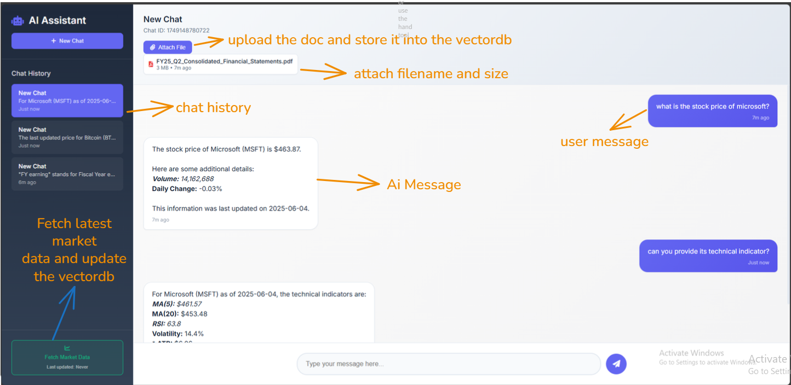
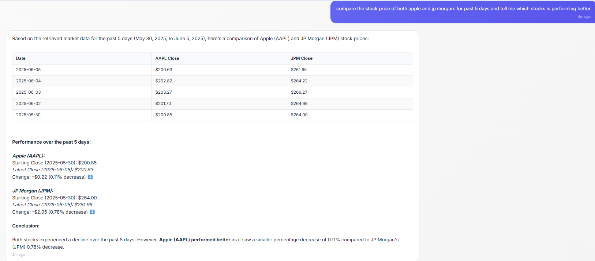
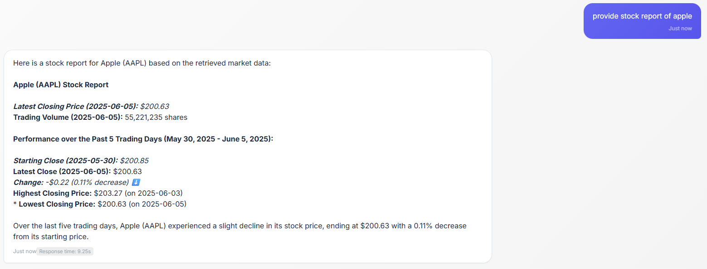
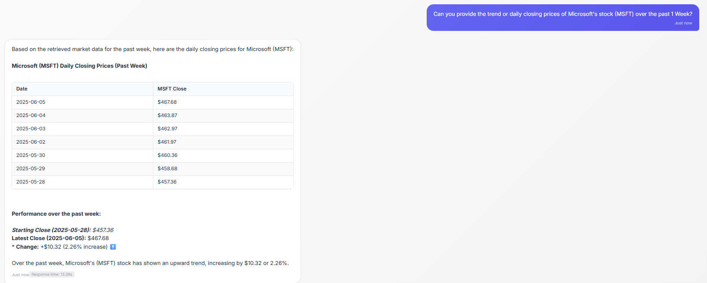

# 🤖 AI-Powered Financial Chat Assistant

A sophisticated AI-powered financial chat assistant that combines Large Language Models (LLM) with Retrieval-Augmented Generation (RAG) capabilities to provide intelligent responses about financial documents and market data.

## 🎯 Project Overview

This application is a comprehensive financial analysis tool that integrates:
- **FastAPI Backend**: RESTful API server with multiple endpoints
- **LLM Integration**: Google Gemini AI for natural language processing
- **Vector Database**: ChromaDB for document and market data storage
- **Document Processing**: LlamaParse for PDF analysis and processing
- **Stock Market Data**: Real-time data fetching from Alpha Vantage API
- **Chat Memory**: SQLite-based conversation persistence
- **Modern Frontend**: Responsive web interface with real-time chat

## Screenshots


**Question** compare the stock price of both apple and jp morgan. for past 5 days and tell me which stocks is performing better


**Question** provide stock report of apple


**Question** Can you provide the trend or daily closing prices of Microsoft's stock (MSFT) over the past 1 Week?



## Demo Video
https://drive.google.com/file/d/1Kvfd3X5sewCnYPEKCyhyxrlPVeCmT1Ym/view?usp=sharing

## 🏗️ Architecture

The system operates in two main modes:

### 1. LLM + RAG Mode (`/core/llm_rag/`)
- Direct LLM interaction with vector database context
- Retrieves relevant documents and market data
- Provides grounded responses with external knowledge

### 2. LLM + RAG + Agent Mode (`/core/llm_rag_agent/`)
- Agentic approach with tool-based interactions
- Dynamic context retrieval through function calling
- Enhanced decision-making capabilities

## 🧠 Technical Overview – Hybrid Stock Market Query System

* Uses a hybrid approach combining LLM and SQLite for intelligent stock market queries
* User submits a natural language query related to stock data
* LLM parses the query to extract structured data: symbols, intent, time range, metrics, aggregation
* Based on the extracted data, dynamically SQL queries are generated
* SQL queries are executed on a local SQLite database containing historical stock prices, volume, and technical indicators
* Retrieves relevant data per symbol with necessary filters and sorting
* Processes results and generates a structured summary report
* Supports various query types like price lookup, trend analysis, volatility checks, and multi-symbol comparison
* Experimental SQL Agent (LangChain + Gemini) can directly translate queries into SQL with financial context. but it is **NOT** used due to not tested properly.

### 🧪 How to Test
Run the following Python command to test the Hybrid Stock Market Query System:
```
python retrieve_market_data_test.py
```


## Vector Database Implementation

### Document VectorDB
- **Chat-specific Collections**: Each chat ID gets its own document collection (`financial_documents_collection_{chat_id}`)
- **PDF Processing**: LlamaParse converts PDFs to markdown, then chunks into 450-character segments
- **Isolation**: Documents uploaded in one chat are not accessible in other chats
- **Storage Path**: `./financial_documents_db/{chat_id}/`

### Vector Engine
- **Embedding Model**: NVIDIA NV-Embed-QA-E5-V5 for high-quality financial content understanding
- **Interface Pattern**: Abstract `VectorDBInterface` with specialized implementations
- **Query Operations**: Semantic search with similarity scoring and metadata filtering
- **Persistence**: Local ChromaDB storage with automatic collection management

## 🚀 Features

### 💬 Chat Functionality
- **Multi-session Support**: Create and manage multiple chat sessions
- **Conversation Memory**: Persistent chat history using SQLite
- **Real-time Responses**: AI responses with metadata
- **Response Time Tracking**: Monitor AI response performance

### 📄 Document Processing
- **PDF Upload**: Upload and process financial documents
- **LlamaParse Integration**: Advanced PDF parsing with markdown output
- **Vector Storage**: Automatic document embedding and storage
- **Per-chat Isolation**: Documents are isolated per chat session

### 📈 Stock Market Analysis
- **Real-time Data**: Fetch live stock and cryptocurrency data
- **Technical Indicators**: Calculate RSI, moving averages, volatility
- **Multiple Assets**: Support for stocks (AAPL, MSFT, JPM) and crypto (BTC, ETH)
- **Vector Integration**: Store market data in searchable format

### 🔍 Vector Database
- **ChromaDB**: Efficient similarity search and retrieval
- **Dual Collections**: Separate storage for documents and market data
- **NVIDIA Embeddings**: High-quality vector representations
- **Flexible Interfaces**: Modular design for different data types

## 🛠️ Technology Stack

### Backend
- **FastAPI**: Modern Python web framework
- **Google Gemini**: Large Language Model integration
- **ChromaDB**: Vector database for embeddings
- **LlamaParse**: PDF document processing
- **Alpha Vantage**: Stock market data API
- **SQLite**: Local database for chat persistence
- **Pandas**: Data manipulation and analysis

### Frontend
- **HTML5/CSS3**: Modern responsive design
- **Vanilla JavaScript**: Clean, dependency-free frontend
- **Font Awesome**: Icon library
- **Google Fonts**: Typography (Inter font family)

### AI/ML Components
- **NVIDIA AI Endpoints**: High-quality embeddings
- **Google GenAI**: LLM for chat responses
- **LangChain**: Document processing and vector operations
- **Tenacity**: Retry logic for API calls

## 📋 Prerequisites

- **Python**: 3.11 or higher
- **API Keys**: 
  - Google AI API key
  - NVIDIA API key
  - Alpha Vantage API key
  - LlamaParse API key

## ⚙️ Installation

### 1. Clone and Setup Environment

```powershell
# Clone the repository
git clone https://github.com/vprashrex/financial-rag-engine.git
cd financial-rag-engine

# Create virtual environment
python -m venv env

# Activate virtual environment
.\env\Scripts\Activate.ps1

# Install dependencies
pip install -r requirements.txt
```

### 2. Environment Configuration

Create a `.env` file in the root directory:

```env
# LLM Configuration
GOOGLE_API_KEY=your_google_api_key_here

# Vector Database
NVIDIA_API_KEY=your_nvidia_api_key_here

# Stock Market Data
VANTAGE_API_KEY=your_alpha_vantage_api_key_here

# Document Processing
LLAMA_PARSE_KEY=your_llama_parse_api_key_here
```


## 🚀 Running the Application

### Full-Stack Server (Recommended)
```powershell
python server.py
```
```
Access at: `http://localhost:8000`
```

## 📚 API Documentation

### Chat Endpoints
- `GET /api/chat/history` - Get all chat sessions
- `GET /api/chat/history/{chat_id}` - Get specific chat messages
- `POST /api/chat/usermessage/{chat_id}` - Send a message

### Document Upload Endpoints
- `POST /api/document_upload/upload/{chat_id}` - Upload PDF document
- `GET /api/document_upload/documents/{chat_id}` - Get uploaded documents

### Stock Market Endpoints
- `POST /api/stock_market/update_stock_data` - Fetch latest market data

### Health Check
- `GET /health` - Server health status

## 🧪 Testing

### Database Initialization
```powershell
# Initialize chat conversation database
python -c "from memory.conv_memory import SQLiteConversationMemory; SQLiteConversationMemory().init_db()"

# Initialize market data database (SQLite with enhanced features)
python -c "from core.stock_market.market_engine import MarketEngine; MarketEngine().init_db()"
```

### Run Individual Tests
```powershell
# Test LLM + RAG functionality
python llm_rag_test.py

# Test LLM + RAG + Agent functionality
python llm_rag_agent_test.py

# Test document retrieval
python retrieve_finacial_document_test.py

# Test market data retrieval (enhanced with smart query routing)
python retrieve_market_data_test.py

# Test market data fetching
python tests/fetch_market_data.py

# Test vector database
python tests/maket_data_vdb.py
```


### Example Test Commands
```powershell
# Test stock market data processing
cd tests
python fetch_market_data.py

# Test vector database operations
python maket_data_vdb.py
```

## 📁 Project Structure

```
task-i/
├── 🚀 server.py                    # Main FastAPI application
├── 🌐 frontend_server.py           # Combined frontend + backend server
├── 📋 requirements.txt             # Python dependencies
├── 🐳 docker-compose.yml          # Docker configuration
├── 📊 conversations.db            # SQLite chat database
│
├── 🔌 api/                        # API endpoints
│   ├── 💬 chat/                   # Chat-related endpoints
│   ├── 📄 document_upload/        # Document upload endpoints
│   └── 📈 stock_market/           # Market data endpoints
│
├── 🧠 core/                       # Core business logic
│   ├── 🤖 llm_rag/               # LLM + RAG implementation
│   ├── 🔧 llm_rag_agent/         # LLM + RAG + Agent implementation
│   ├── 📄 document_analyzer/      # Document processing engine
│   ├── 📊 stock_market/           # Market data processing
│   ├── 🗄️ vector/                # Vector database interfaces
│   └── 🛠️ AgentTool/             # Agent tools and functions
│
├── 💾 memory/                     # Chat memory management
├── 🎨 static/                     # Frontend assets (CSS, JS)
├── 📱 templates/                  # HTML templates
├── 🧪 tests/                      # Test files
└── 📝 logs/                       # Application logs
```

## 🔧 Configuration

### Vector Database Settings
- **Embedding Model**: NVIDIA NV-Embed-QA
- **Chunk Size**: 1000 characters
- **Chunk Overlap**: 200 characters
- **Persistence**: Local ChromaDB storage

### LLM Configuration
- **Model**: Google Gemini Pro
- **Temperature**: Configurable for creativity/precision balance
- **Max Tokens**: Optimized for financial analysis responses
- **Retry Logic**: Built-in exponential backoff

### Market Data Configuration
- **Supported Stocks**: AAPL, MSFT, JPM
- **Supported Crypto**: BTC, ETH
- **Technical Indicators**: RSI, Moving Averages, Bollinger Bands, ATR
- **Update Frequency**: On-demand via API
- **Smart Query Routing**: Automatic classification of simple vs analytical queries
- **Performance Optimization**: Query caching, fallback mechanisms
- **SQL Agent Integration**: LangChain SQL agents for complex analytics

### Enhanced Market Engine Features
- **🧠 Smart Query Classification**: Automatically routes queries based on complexity
  - Simple queries (latest prices, basic data) → Direct SQL
  - Analytical queries (trends, comparisons) → AI-powered SQL agent
- **⚡ Performance Optimization**:
  - Query result caching with TTL
  - Reduced SQL agent calls for better performance
  - Fallback mechanisms for reliability
- **📊 Analytics Tracking**: Monitor query patterns and system performance
- **🔄 Real-time vs Historical Data Separation**: Optimized handling based on query type

## 🎨 Frontend Features

### Modern UI/UX
- **Responsive Design**: Works on desktop and mobile
- **Dark Theme**: Professional financial application styling
- **Real-time Updates**: Live chat interface with typing indicators
- **File Upload**: Drag-and-drop PDF upload with progress tracking

### Chat Interface
- **Multi-session Support**: Switch between different conversations
- **Message History**: Persistent chat history with timestamps
- **Response Metadata**: Display response times and AI model info
- **Export Options**: Download chat histories

## 📊 Monitoring and Logging

### Logging System
- **Structured Logging**: Separate logs for different components
- **Log Levels**: Debug, Info, Warning, Error
- **Log Rotation**: Automatic log file management
- **Performance Metrics**: Response time tracking

### Log Categories
```
logs/
├── apiServer/     # API endpoint logs
├── llm/          # LLM interaction logs
├── stock/        # Market data logs
└── vector/       # Vector database logs
```

### Docker Deployment
```powershell
# Build Docker image
docker build -t financial-chat-assistant .

# Run container
docker run -p 8000:8000 --env-file .env financial-chat-assistant
```

## 🤝 Usage Examples

### 1. Financial Document Analysis
1. Upload a PDF financial report
2. Ask: "What are the key findings in this earnings report?"
3. Get AI-powered analysis with document citations

### 2. Market Data Queries
1. Fetch latest market data
2. Ask: "What's the current RSI for Apple stock?"
3. Get real-time technical analysis

### 3. Combined Analysis
1. Upload financial documents and fetch market data
2. Ask: "How does the latest earnings report relate to Apple's stock performance?"
3. Get comprehensive analysis combining both data sources


## 📈 Performance Optimization

### Vector Database
- **Batch Processing**: Efficient document chunking
- **Parallel Processing**: Concurrent embedding generation
- **Caching**: Intelligent query result caching

### API Performance
- **Connection Pooling**: Efficient database connections
- **Async Operations**: Non-blocking I/O operations
- **Response Compression**: Reduced bandwidth usage